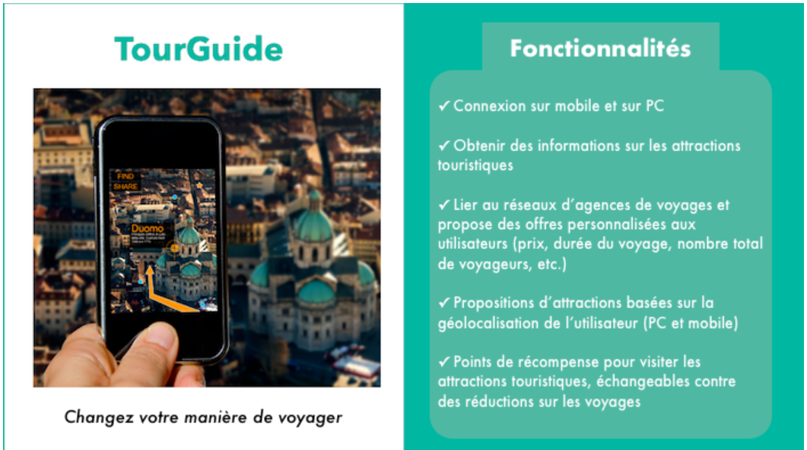
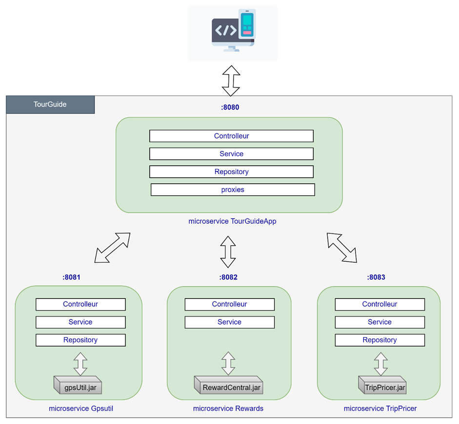
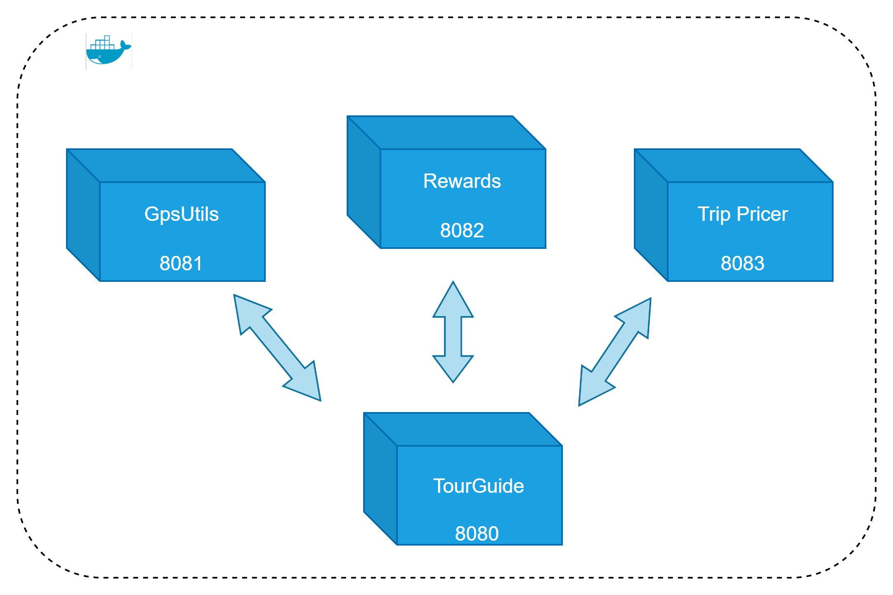

_TourGuide _ is a Spring Boot application and a centerpiece of the portfolio
Trip Master applications. It allows users to see what are the
tourist attractions nearby and get discounts on stays
as well as tickets to various shows.

---------
## Technical:
1. Spring Boot v 2.7.0
2. Java 11
3. Gradle 7.4.1
4. Docker v 20.10.14

---------

## Getting Started

### Running App

To run TourGuide App:

1. Install docker compose on your station if you don’t have it.
   https://docs.docker.com/compose/install/

3. Build the jar for each microservice :
   - Go to the principal folder where is build.gradle and run the command : `gradle build`

3. When all jars are built, perform the command. : `docker-compose up -d`  

4. To stop the application run the command : `docker-compose down`

### Testing

- To run the tests execute the command: `gradle test`

### Architecture

1. Microservice architecture
   

2. Docker architecture

   